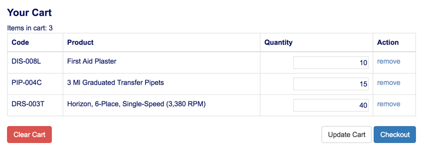
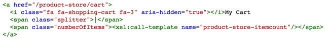
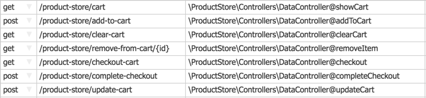

Product Store
=============

This extension defines a product-store node which can be used to manage unlimited projects, using nested categories. A check-out and search function is available.

### Features

- unlimited nested product categories
- single list of products, manageable like a spreadsheet
- each product contains 
  - title, description, features
  - images
  - list of SKUs
- displaying products and categories using by-id routes
- friendly URLs
- customizable product search
- add-to-cart functionality

### Friendly URLs

Products can be accessed via

- /product/{product-id}
- /category/{category-id}

### Search Function

the following routes are defined, which provide a simple, yet very customizable search capability:

 GET|POST /product-store/search

This route calls the template **product-store-search**, which expects the search query to be set in input variable **$q**

Currently, the template implements a simple, case-insensitive search, matching any substring in the product title, however this template can easily be overridden by defining a template as such:

 

 **Default Search Template**

 

### Shopping Cart Function

The shopping cart allows for adding of any product item to a centralized shopping cart that is displayed to the user after adding an item. Item quantities can be updated in bulk, with invalid entries handled gracefully.

#### Sample Layout

####  

####   
 Note: only positive integers are allowed for quantities.

By default, the store cart can be accessed at:

- **/product-store/cart**

 The total item count can be rendered within any layout by calling the template **product-store-itemcount**

 

 

####  **All defined shopping cart routes** 

####  