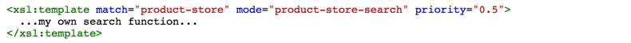
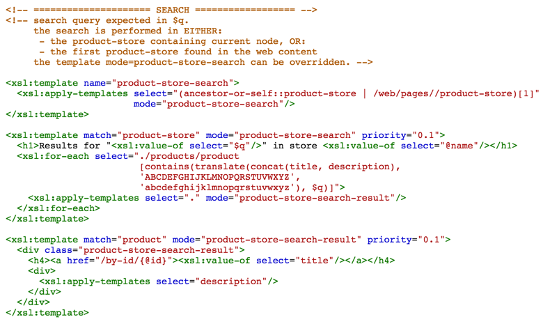

Product Store
=============

This extension defines a product-store node which can be used to manage unlimited projects, using nested categories. A check-out and search function is available.

### Features

- unlimited nested product categories
- single list of products, manageable like a spreadsheet
- each product contains 
  - title, description, features
  - images
  - list of SKUs
- displaying products and categories using by-id routes
- friendly URLs
- customizable product search
- add-to-cart functionality

### Friendly URLs

Products can be accessed via

- /product/{product-id}
- /category/{category-id}

### Search Function

the following routes are defined, which provide a simple, yet very customizable search capability:

GET|POST /product-store/search

This route calls the template **product-store-search**, which expects the search query to be set in input variable **$q**

Currently, the template implements a simple, case-insensitive search, matching any substring in the product title, however this template can easily be overridden by defining a template as such:

**Default Search Template**

### Add-to Cart Function

- each SKU can be added to a cart
- show cart
- customizable checkout